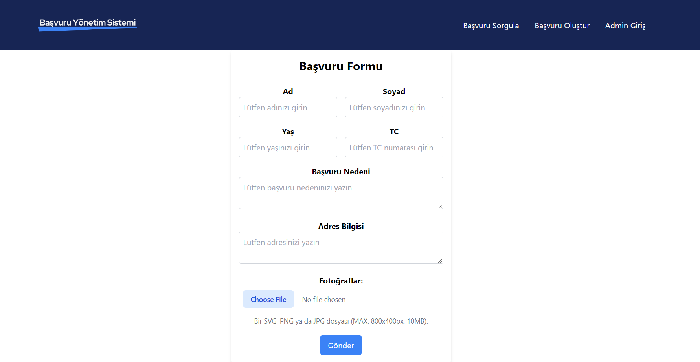
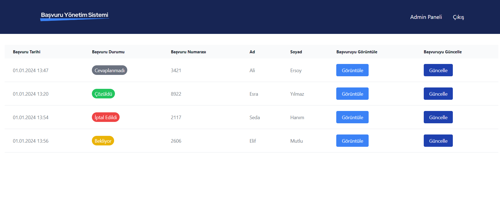
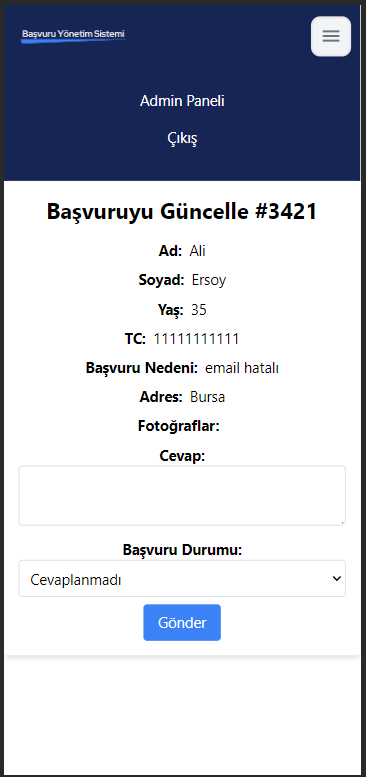
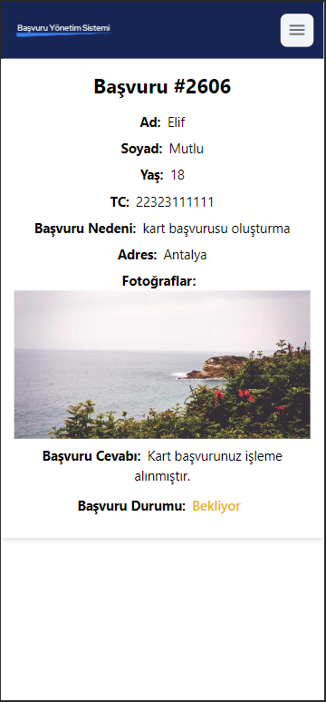
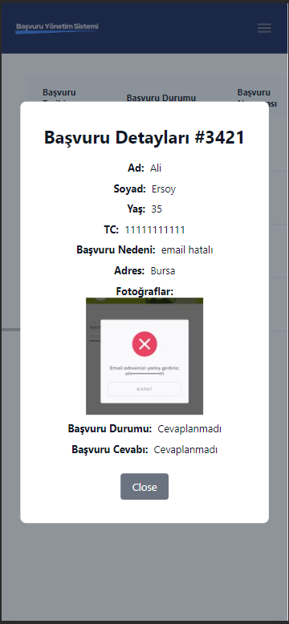

<h1>
Application Management System
</h1>

This project involves a public application form that users can fill out to initiate a submission.
Upon completion, users receive a unique code to track the status of their application. 
The system allows users to check the response on a dedicated page using the assigned code.

Admins, logging in with a username and password, can view incoming applications. 
They have the ability to review and respond to unanswered applications, updating their status to resolved, canceled, pending etc.

### To login as an admin:

username: kodluyoruz

password: bootcamp109

# Deployment

The web app is deployed and accessible [here](https://coruscating-alfajores-652f87.netlify.app/basvuru-olustur).

# How to run on Local

## Clone
```terminal
$ git clone https://github.com/beyza-armagan/patika-fimple-final-case.git

$ npm i
```

## Client Side Usage
```terminal
$ cd client          // go to the client folder
$ npm i              // npm install packages
$ npm run dev        // run it locally
```
## Server Side Usage
```terminal
$ cd backend         // go to the backend folder
$ npm i              // npm install packages
$ cd src             // go to the src folder
$ node server        // run it locally
```

### Prepare your secret

You need to add a MONGODB_URI, JWT_SECRET and JWT_REFRESH_SECRET in .env file

```terminal
// in the root level
$ cd backend
$ echo "MONGODB_URI=YOUR_MONGODB_URI" >> src/.env
$ echo "JWT_SECRET=YOUR_JWT_SECRET" >> src/.env
$ echo "JWT_REFRESH_SECRET=YOUR_JWT_REFRESH_SECRET" >> src/.env
```

# Screenshots



<p float="left">
  
  
  
</p>

# Technologies Used

- **Backend:**
  - Node.js
  - Express
  - MongoDB

- **Frontend:**
  - React
  - Tailwind CSS

- **Deployment:**
  - Netlify
  - Render
 
- **Validation Library:**
  - yup


# File Structure
- backend/
  - src/
    - controllers/
      - authController.js
      - ticketController.js
    - database/
      - db.js
    - helpers/
      - jwt.js
    - models/
      - imageSchema.js
      - ticketSchema.js
      - userSchema.js
    - routes/
      - authRoutes.js
      - ticketRoutes.js
    - server.js
  - .gitignore
  - package-lock.json
  - package.json

- client/
  - public/
    - bundle.js
    - index.html
  - src/
    - assets/
    - components/
      - Admin/
        - AdminLogin.jsx
        - ApplicationDetailsModal.jsx
        - ApplicationList.jsx
        - UpdateApplicationPage.jsx
      - Navbar/
        - Navbar.jsx
    - context/
      - AuthContext.jsx
      - DataContext.jsx
    - pages/
      - ApplicationSuccessful.jsx
      - CreateApplication.jsx
      - SearchApplication.jsx
      - SearchDetails.jsx
      - styles.css
    - utils/
      - formatDate.js
      - validationSchemas.js 
    - App.css
    - App.jsx
    - index.css
    - main.jsx
  - index.html
  - package-lock.json
  - package.json

- .gitignore
- package-lock.json
- package.json
- README.md
